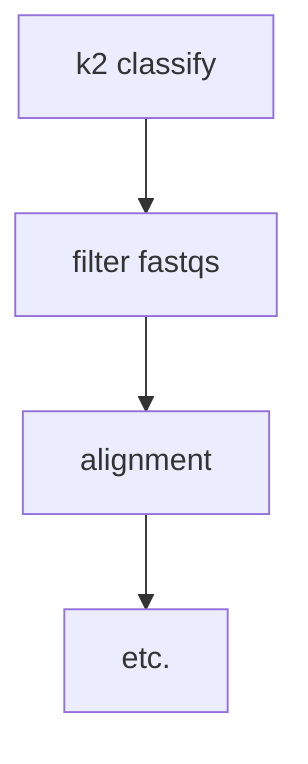

[](https://crates.io/crates/k2tools)
[](https://bioconda.github.io/recipes/k2tools/README.html)
[](https://github.com/fulcrumgenomics/k2tools/blob/main/LICENSE)

# k2tools

A fast Rust CLI toolkit for working with [kraken2](https://github.com/DerrickWood/kraken2) outputs, particularly filtering of inputs (FASTQs) to one or more taxa based on kraken's classification.

<p>
<a href="https://fulcrumgenomics.com"></a>
</p>

<a href="mailto:contact@fulcrumgenomics.com?subject=[GitHub inquiry]"></a>
<a href="https://www.fulcrumgenomics.com"></a>

## Motivation

`k2tools` is largely aimed at those using the excellent [kraken2](https://github.com/DerrickWood/kraken2) toolkit for non-metagenomic purposes!  It's frequently used in a non-metagenomic context to separate host reads from other contaminants - e.g. in human saliva samples which can contain both food particles and microbial cells and DNA.  In this workflow one tends to follow a process like:



However, the step for going from the kraken2 report to a set of filtered fastqs can be a little challenging.  It requires parsing the kraken2 report, which has a great structure for humans, but is not the _most_ machine readable.  And then you need to read and filter the kraken2 output and fastqs in sync.  The [KrakenTools](https://github.com/jenniferlu717/KrakenTools) repo has a python script to do this, but it's many times slower than running kraken2, and is single-threaded.

Thanks to our earlier work on [fqtk](https://github.com/fulcrumgenomics/fqtk), we developed the [pooled-writer](https://github.com/fulcrumgenomics/pooled-writer) crate for multi-file parallel compression and writing.  Using that it's easy to scale performance with threads, and perform the filtering step in a fraction of the time it takes kraken2 to do the classification!

## Available Commands

| Command | Description |
|---------|-------------|
| `filter` | Extract classified/unclassified reads from FASTQ files based on kraken2 results |
| `report-to-tsv` | Convert a kraken2 report to a clean, header-bearing TSV with derived columns |

## Installation

### Installing with Conda (bioconda)

```bash
conda install -c bioconda k2tools
```

### Installing with Cargo

```bash
cargo install k2tools
```

### Building from source

Clone the repository and build:

```bash
git clone https://github.com/fulcrumgenomics/k2tools.git
cd k2tools
cargo build --release
```

The binary will be at `target/release/k2tools`.

## Usage

For a list of all commands:

```bash
k2tools --help
```

For detailed usage of any command:

```bash
k2tools <command> --help
```

### `filter`

Extracts reads from FASTQ files that were classified to one or more taxa by kraken2.  Requires three inputs from the same kraken2 run: the report file (`-r`), the per-read classification output (`-k`), and the FASTQ file(s) (`-i`).  Supports single-end and paired-end reads, gzip/bgzf-compressed inputs, and writes bgzf-compressed output.

Extract all reads classified as *E. coli* (taxon 562):

```bash
k2tools filter \
    -r report.txt -k kraken_output.txt \
    -i reads.fq.gz -o ecoli.fq.gz \
    -t 562
```

Extract an entire genus (taxon 543) including all species and strains beneath it:

```bash
k2tools filter \
    -r report.txt -k kraken_output.txt \
    -i reads.fq.gz -o entero.fq.gz \
    -t 543 -d
```

Extract unclassified reads from a paired-end run:

```bash
k2tools filter \
    -r report.txt -k kraken_output.txt \
    -i r1.fq.gz r2.fq.gz -o unclass_r1.fq.gz unclass_r2.fq.gz \
    -u
```

Combine taxon extraction with unclassified reads in a single pass:

```bash
k2tools filter \
    -r report.txt -k kraken_output.txt \
    -i reads.fq.gz -o human_and_unclass.fq.gz \
    -t 9606 -d -u
```

### `report-to-tsv`

Converts a kraken2 report (standard 6-column or extended 8-column format) into a clean TSV with clearly named columns, derived parent information, taxonomy level, descendant counts, and sequence fraction columns.

```bash
# Write to a file
k2tools report-to-tsv -r kraken2_report.txt -o report.tsv

# Write to stdout for piping
k2tools report-to-tsv -r kraken2_report.txt | head
```

Output columns:

| Column | Description |
|--------|-------------|
| `tax_id` | NCBI taxonomy ID |
| `name` | Scientific name |
| `rank` | Taxonomic rank code (e.g. `S`, `G`, `D1`) |
| `level` | Depth in the taxonomy tree (0 for root and unclassified) |
| `parent_tax_id` | Parent taxon ID (empty for root/unclassified) |
| `parent_rank` | Parent rank code (empty for root/unclassified) |
| `clade_count` | Fragments in the clade rooted at this taxon |
| `direct_count` | Fragments assigned directly to this taxon |
| `descendant_count` | `clade_count` minus `direct_count` |
| `frac_clade` | `clade_count / total_sequences` |
| `frac_direct` | `direct_count / total_sequences` |
| `frac_descendant` | `descendant_count / total_sequences` |
| `minimizer_count` | Minimizers in clade (empty if not in report) |
| `distinct_minimizer_count` | Distinct minimizers (empty if not in report) |

## Output Format

k2tools produces clean TSV output designed for easy downstream consumption:

- **Lowercase `snake_case` headers** (e.g. `clade_count`, `frac_direct`)
- **Tab-separated** with no metadata or comment lines
- **Fractions use `frac_` prefix** (e.g. `frac_clade` not `pct_clade`)

## Resources

* [Releases](https://github.com/fulcrumgenomics/k2tools/releases)
* [Issues](https://github.com/fulcrumgenomics/k2tools/issues): Report a bug or request a feature
* [Pull requests](https://github.com/fulcrumgenomics/k2tools/pulls): Submit a patch or new feature
* [Contributors guide](https://github.com/fulcrumgenomics/k2tools/blob/main/CONTRIBUTING.md)
* [License](https://github.com/fulcrumgenomics/k2tools/blob/main/LICENSE): Released under the MIT license

## Authors

- [Tim Fennell](https://github.com/tfenne)

## Disclaimer

This software is under active development.
While we make a best effort to test this software and to fix issues as they are reported, this software is provided as-is without any warranty (see the [license](https://github.com/fulcrumgenomics/k2tools/blob/main/LICENSE) for details).
Please submit an [issue](https://github.com/fulcrumgenomics/k2tools/issues), and better yet a [pull request](https://github.com/fulcrumgenomics/k2tools/pulls) as well, if you discover a bug or identify a missing feature.
